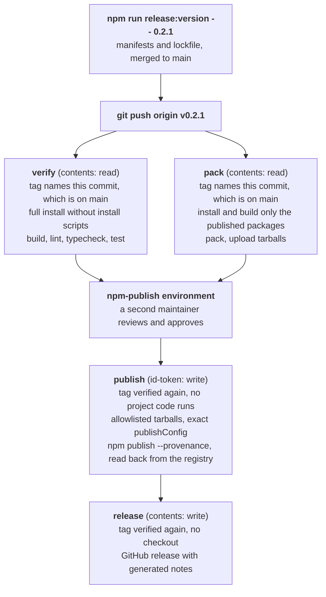

# Releasing

Maintainer runbook for publishing `@crewlethq/tokens`, `@crewlethq/icons` and `@crewlethq/ui` to [registry.npmjs.org](https://www.npmjs.com/org/crewlethq). Nothing here is needed to use the packages; it is process for people with write access to this repository.

A release is a pushed `v<version>` tag on a commit that is on `main`. [`.github/workflows/release.yml`](.github/workflows/release.yml) verifies the tagged commit, builds and packs the three packages, publishes them through [npm trusted publishing](https://docs.npmjs.com/trusted-publishers) with provenance, and creates the GitHub release. No npm token is stored anywhere: the publish job exchanges its GitHub Actions OIDC identity for a short-lived npm credential that is valid for that one publish.

---

## How a release flows



The jobs are separate on purpose:

- **No job that runs third-party code holds a credential worth stealing.** Only `verify` and `pack` install dependencies and build, and both hold a read-only token. No install script runs anywhere (`npm ci --ignore-scripts`).
- **The published bytes come from as little code as possible.** `pack` installs only the root tooling and the three published workspaces (`node scripts/release.mjs build`), so the Storybook, its bundler and every dependency only they use are never present when the tarballs are produced. `verify` runs everything else, and `publish` waits for both.
- **The job that can publish runs nothing from the repository** apart from the two composite actions in `.github/actions`, and the job that can write to the repository has no checkout at all.
- **Every job asks the GitHub API which commit the tag names now** ([`verify-release-ref`](.github/actions/verify-release-ref/action.yml)) and fails unless it is the commit the run started for and that commit is on `main`. A tag on an unmerged commit, or a tag moved while a run waited for approval, publishes nothing.

---

## Versioning

- **One version for all three packages**, recorded in their `package.json` files. `@crewlethq/ui` depends on the tokens and icons of exactly that version, because those are the only ones it was built and tested against.
- **The manifests are the source of truth and the tag must agree.** `node scripts/release.mjs check --tag <tag>` runs in `verify` and `pack` before anything is installed, and refuses a tag that is not `v<version>`. The same check, without the tag, runs in CI's `verify` job on every pull request: it also covers the workspace dependency pins, the manifest metadata publishing relies on, the sources recorded in both lockfiles, and the Node and npm pins. CI's `pack` job runs `node scripts/release.mjs build` and `node scripts/release.mjs pack <directory>` exactly as a release does. To run the pack locally after `npm run build`, use `npm run release:pack -- "$(mktemp -d)"`.
- **[Semantic versioning](https://semver.org/).** The patch number moves for fixes and the minor number for features. While the major number is `0`, a breaking change (a renamed export, CSS class, CSS variable, icon name or import path) also moves the minor number.
- **Pre-releases** (`0.3.0-rc.1`) are released the same way. They are published under the `next` dist-tag, so `npm install @crewlethq/ui` never selects one, and the GitHub release is marked as a pre-release.
- **There is one release line.** A stable release is always published under `latest`, so a fix for an older minor is released as a new version on the current line.

---

## Cutting a release

1. **Set the version** on a branch and open a pull request:

   ```bash
   npm run release:version -- 0.2.1
   git add package-lock.json packages/*/package.json apps/*/package.json
   git commit -s -m "chore(release): prepare 0.2.1"
   ```

   The script writes the version into every published manifest and every workspace dependency, refreshes `package-lock.json`, and re-runs the consistency check.

2. **Read the merged pull requests** since the previous tag. The GitHub release body is generated from their titles and grouped by [`.github/release.yml`](.github/release.yml), so edit any title that does not read as a release note before tagging.

3. **Merge the pull request** once CI is green, then tag the merge commit on `main`:

   ```bash
   git fetch origin
   git tag -a v0.2.1 -m "v0.2.1" origin/main
   git push origin v0.2.1
   ```

4. **Review and approve the deployment.** The run pauses at the `npm-publish` environment. Before approving, open the run under **Actions** and confirm:
   - both `verify` and `pack` passed, and each ran the "Verify that the tag names this commit and that it is on main" step, which printed the tag, the commit and "which is on main";
   - the workflow and release tooling at the tag are the reviewed ones on `main`. The tag is on `main`, so this command prints nothing unless `main` has changed them since:

     ```bash
     git fetch origin --tags
     git diff v0.2.1 origin/main -- .github scripts package.json package-lock.json
     ```

   - the `pack` job's "Pack the published packages" step lists the three tarballs you expect (file counts and sizes).

   The integrity values in that step only show that the artifact the publish job downloads is the one `pack` produced. They say nothing about whether the code that produced it was the reviewed code; the two checks above do. Then choose **Review deployments** and approve.

5. **Verify the release** once the run is green:

   ```bash
   npm view @crewlethq/ui@0.2.1 dist.attestations --json   # provenance is attached
   mkdir /tmp/uilet-verify && cd /tmp/uilet-verify && npm init -y >/dev/null
   npm install --save-exact @crewlethq/tokens@0.2.1 @crewlethq/icons@0.2.1 @crewlethq/ui@0.2.1
   npm audit signatures                                       # registry signatures and attestations verify
   ```

   Open the GitHub release and check that it carries no attached files and that its first lines link to the three npm versions.

---

## One-time setup

These settings live on npmjs.com, on Cloudflare and in the GitHub repository settings, not in this tree, so nothing in CI can detect when one of them is missing or changed. Work through them in this order.

### 1. Before anything public names the packages: the npm organization

npm scopes are first come, first served, and this repository's README, manifests and workflows name `@crewlethq`. Whoever creates the `crewlethq` organization first owns every package name in it, and a package published there by someone else could never be replaced by the real release.

1. Create the `crewlethq` organization on npmjs.com **before the repository is made public**.
2. Add at least two owners, so losing one account never locks the packages.
3. Require two-factor authentication for every member (**Organization settings**).
4. Confirm the scope is held and empty. This must answer HTTP 200 with `{}`:

   ```bash
   curl -s -w '\nHTTP %{http_code}\n' https://registry.npmjs.org/-/org/crewlethq/package
   ```

### 2. The GitHub repository

1. **Team and collaborators** (**Settings, Collaborators and teams**). Create the `crewlet/uilet-maintainers` team, which [`.github/CODEOWNERS`](.github/CODEOWNERS) names, with the maintainers who review and release, and give it the Maintain role. No other account, and in particular no machine account, has write access; nothing in this repository's automation needs one.
2. **Branch ruleset for `main`** (**Settings, Rules, Rulesets, New branch ruleset**), targeting the default branch, with no bypass list:
   - **Restrict deletions** and **Block force pushes**.
   - **Require a pull request before merging**, with 1 required approval, **Dismiss stale pull request approvals when new commits are pushed**, **Require review from Code Owners** and **Require approval of the most recent reviewable push**.
   - **Require status checks to pass**, requiring the `ci` checks `verify`, `pack`, `sign-off` and `workflows`.

   Both the `storybook` environment's credential and every release rely on `main` holding only reviewed commits, so this ruleset is what protects them.
3. **Tag ruleset** (**New tag ruleset**): target tags matching `v*`, restrict creations, updates and deletions to the maintainers who release. A published tag is never moved or deleted.
4. **Environment `npm-publish`** (**Settings, Environments**):
   - **Required reviewers:** the maintainers allowed to release, with **Prevent self-review** enabled so the person who pushed the tag cannot approve their own release alone.
   - **Deployment branches and tags:** "Selected branches and tags", with a single tag rule `v*`.
   - **Allow administrators to bypass configured protection rules:** disabled.
   - No environment secrets or variables. Publishing needs none.
5. **Environment `storybook`**:
   - **Deployment branches and tags:** "Selected branches and tags", with a single branch rule `main`.
   - **Environment variable** `CLOUDFLARE_PAGES_PROJECT`: the name of the Pages project the Storybook deploys to.
   - **Environment secrets** `CLOUDFLARE_ACCOUNT_ID` and `CLOUDFLARE_API_TOKEN`, as described under [Cloudflare](#3-cloudflare). No repository-level or organization-level copy of either may exist, so no other workflow or branch can read them.
6. **Actions** (**Settings, Actions, General**):
   - **Actions permissions:** allow actions created by GitHub, plus the specified action `zizmorcore/zizmor-action@*`, and enable **Require actions to be pinned to a full-length commit SHA**.
   - **Approval for running fork pull request workflows from contributors:** "Require approval for all external contributors".
   - **Workflow permissions:** "Read repository contents and packages permissions", with **Allow GitHub Actions to create and approve pull requests** disabled, so a workflow can never supply the approval the `main` ruleset requires.
7. **Security** (**Settings, Advanced Security**): enable **Private vulnerability reporting** (the channel [SECURITY.md](SECURITY.md) names), **Dependabot alerts**, **Dependabot security updates**, **Secret scanning** and **Push protection**.
8. **Releases** (**Settings, General, Releases**): enable **release immutability**, so the files and the tag of a published GitHub release cannot be changed afterwards.

The trusted publisher configuration on npm matches the workflow file name `release.yml` and the environment name `npm-publish`. Renaming either one stops publishing until the configuration on npm is updated to the new name.

### 3. Cloudflare

A Cloudflare API token with the Pages permission can deploy every Pages project on its account; the permission cannot be narrowed to one project. The Storybook deployment therefore runs on a Cloudflare account that holds nothing else:

1. Create a dedicated Cloudflare account for the Storybook and create its Pages project there. No other Pages project, zone or Worker lives on that account.
2. Create an account API token for that account with the single permission **Account, Cloudflare Pages, Edit**, and an expiry date. Record the expiry, and replace the token before it passes.
3. Store the account ID and the token as the `storybook` environment secrets, and the project name as its variable (see above).

### 4. First publish (bootstrap)

npm can only attach a trusted publisher to a package that already exists, so the first version of each package is published once by an owner. The bootstrap publishes the exact tarballs the release workflow built, so the first release is the same bytes a normal release would have produced. Those first versions carry no provenance, because only a CI identity can produce an attestation; every later version does.

Do this after the repository is public and every setting above is in place. Before starting, run the check in step 4 of [the npm organization](#1-before-anything-public-names-the-packages-the-npm-organization) again: the scope must still be held by the organization and contain no package.

1. **Push the first tag** (the manifests already say `0.2.0`):

   ```bash
   git tag -a v0.2.0 -m "v0.2.0" origin/main
   git push origin v0.2.0
   ```

   Wait for `verify` and `pack` to finish. The run then waits for approval at `npm-publish`. **Do not approve it yet.** The publish job would fail, because no trusted publisher exists.

2. **Download the tarballs** the `pack` job uploaded, and confirm their integrity matches the values its "Pack the published packages" step printed:

   ```bash
   mkdir uilet-0.2.0 && cd uilet-0.2.0
   gh run download <run-id> --repo crewlet/uilet --name packages
   for f in *.tgz; do echo "$f sha512-$(openssl dgst -sha512 -binary "$f" | base64 | tr -d '\n')"; done
   ```

3. **Publish them as an owner**, in dependency order. Check each tarball's publish metadata first, exactly as the publish job does: every line must print `{"access":"public","registry":"https://registry.npmjs.org"} false`. Then sign in interactively with an account that has two-factor authentication, publish with the access and dist-tag given explicitly, and sign out, which revokes the session token:

   ```bash
   for f in ./crewlethq-*-0.2.0.tgz; do
     echo "$f $(tar -xOzf "$f" package/package.json | jq -cS .publishConfig) $(tar -xOzf "$f" package/package.json | jq 'has("tag")')"
   done
   npm login --registry https://registry.npmjs.org
   npm publish ./crewlethq-tokens-0.2.0.tgz --access public --tag latest
   npm publish ./crewlethq-icons-0.2.0.tgz --access public --tag latest
   npm publish ./crewlethq-ui-0.2.0.tgz --access public --tag latest
   npm logout --registry https://registry.npmjs.org
   ```

   If an interactive login is not possible, create a granular access token on npmjs.com instead: read and write permission limited to the `@crewlethq` scope, "Bypass two-factor authentication" left unchecked, and the shortest expiration offered. Use it for these three commands only, then delete it on npmjs.com.

4. **Configure the trusted publisher** for each package. This needs npm 11.10.0 or later and an account with two-factor authentication:

   ```bash
   for package in tokens icons ui; do
     npm trust github "@crewlethq/${package}" --repository crewlet/uilet --file release.yml --environment npm-publish --yes
     sleep 2
   done
   npm trust list @crewlethq/ui
   ```

5. **Disallow token publishing.** For each package, open **Settings, Publishing access** on npmjs.com and choose "Require two-factor authentication and disallow tokens" (or run `npm access set mfa=publish @crewlethq/<package>`). Trusted publishing keeps working under this setting; a stolen or forgotten token no longer can. Delete the granular token now if step 3 used one.

6. **Approve the waiting `npm-publish` deployment**, after the review in step 4 of [Cutting a release](#cutting-a-release). The publish job finds each version already on the registry with the same integrity, skips it, and the release job creates the `v0.2.0` GitHub release.

   A deployment waits at most 30 days. If it expired, re-running the workflow rebuilds the tarballs, and any byte of difference from what step 3 published fails the publish job by design. In that case create the release directly with `gh release create v0.2.0 --repo crewlet/uilet --verify-tag --generate-notes`.

7. **Release `0.2.1` through the normal flow** as soon as there is a change to ship. It is the first version published through trusted publishing, and `npm view @crewlethq/ui@0.2.1 dist.attestations` proves the whole path end to end.

### Adding a published package later

A new public workspace under `packages/` is picked up by `scripts/release.mjs` automatically, which also enforces its manifest metadata, installs and builds it in the `pack` job, and verifies its tarball. It additionally needs:

1. Its expected SPDX license expression in `LICENSES` in `scripts/release.mjs`, and a copy of the root `LICENSE` in its directory.
2. Its name added to both package lists in `release.yml` (the publish allowlist, in dependency order, and the release notes). Until then the publish job refuses the extra tarball.
3. Its own bootstrap: when the first release that contains it is tagged, publish that package's tarball from the run's artifact as in step 3 above, configure its trusted publisher and publishing access as in steps 4 and 5, then approve the deployment.

---

## Dependency updates

[Dependabot](.github/dependabot.yml) opens weekly pull requests, each committing as `build(deps)`, for the actions in the workflows and composite actions, for the npm workspace, and for the Wrangler release in [`.github/deploy`](.github/deploy/package.json) that the Storybook deployment installs.

- **A version update waits for its release to age**: 7 days, or 14 for a new major. Compromised npm releases have typically been live for hours to a few days before removal, and the cooldown keeps them out of the weekly pull requests. Security updates are not delayed by it.
- **Actions are pinned to full commit SHAs** with the release in a trailing comment (`# v7.0.1`), and the repository setting requires it. Dependabot moves both together. When adding an action by hand, pin its newest release the same way: `gh api repos/<owner>/<action>/git/ref/tags/<tag> --jq .object` gives the commit (dereference it with `gh api repos/<owner>/<action>/git/tags/<sha> --jq .object.sha` when the type is `tag`), and add the action to the allowed actions setting. The `workflows` CI job runs zizmor over every workflow, and the zizmor release it runs is the one recorded in the pinned `zizmor-action` release, so it moves with that action's SHA.
- **The Node toolchain is moved by hand, because Dependabot tracks none of its three pins**: `.nvmrc` names one exact Node release, the root `package.json` `packageManager` field names the npm that release bundles, and every job runs on `ubuntu-24.04`. Move `.nvmrc` and `packageManager` together, at least monthly and whenever Node publishes a security release: `curl -s https://nodejs.org/dist/index.json | jq -r '[.[] | select(.lts)][0] | .version + " npm " + .npm'` gives the newest LTS release and its npm. Every CI job fails when the installed npm differs from `packageManager`, and `release.mjs check` fails when either pin is a range or the npm is older than trusted publishing needs. Move the runner label when GitHub publishes the next Ubuntu LTS image.
- **`.npmrc` must not set `engine-strict`.** Dependabot installs with its own Node, and engine-strict turns the root `engines` field into a refusal that silently stops every npm update.

---

## If a release goes wrong

**Before pushing a tag again for any reason, cancel every release run still waiting for approval**, so an older run can never be approved for a commit the tag no longer names. (Its publish job would refuse, because it checks the tag again, but a cancelled run cannot be approved by mistake at all.)

```bash
gh run list --repo crewlet/uilet --workflow release.yml --status waiting
gh run cancel <run-id> --repo crewlet/uilet
```

**`verify` or `pack` failed** (for example the tag does not match the manifests, or it is not on `main`). Nothing was published. Delete the tag, fix the cause on `main`, and tag again:

```bash
git push --delete origin v0.2.1
git tag -d v0.2.1
```

**The publish job failed partway.** Fix the cause (usually a trusted publisher or environment setting) and re-run the failed jobs. Versions that did publish are recognised by their integrity and skipped, so the re-run finishes the release. If it failed after publishing because a dist-tag does not name the release, move the tag with the command the error prints, then re-run.

**The publish job refuses a version that is already on the registry with different contents.** A published npm version can never be replaced. Release the next patch version instead.

**The release job refuses a release that already exists.** Someone other than the workflow created a release for the tag. Read who created it, what its notes link to and what files are attached before anything else; delete it only once you know it is not needed as evidence.

**A published version is broken.** Release the fix as a new version, then deprecate the broken one for each package so installs warn:

```bash
npm deprecate @crewlethq/ui@0.2.1 "Broken styles in DataTable; use 0.2.2 or later"
```

npm only allows unpublishing within 72 hours and under narrow conditions, and a consumer lockfile that already resolved the version breaks when it disappears, so prefer deprecation.

**Never move or delete a tag that published.** The tag, the npm version, the provenance statement and the GitHub release all name the same commit.
