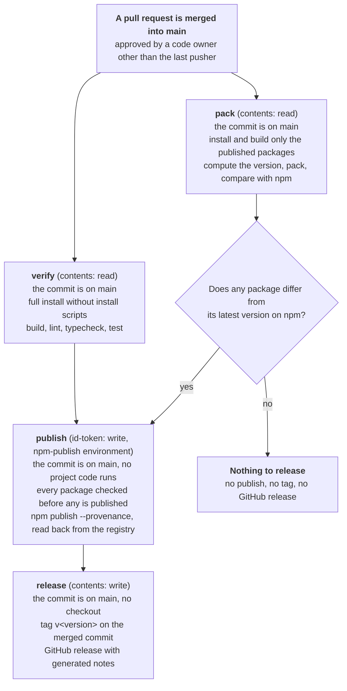

# Releasing

Maintainer runbook for publishing `@crewlethq/tokens`, `@crewlethq/icons` and `@crewlethq/ui` to [registry.npmjs.org](https://www.npmjs.com/org/crewlethq). Nothing here is needed to use the packages; it is process for people with write access to this repository.

**Every merge to `main` is released automatically.** [`.github/workflows/release.yml`](.github/workflows/release.yml) runs on the push the merge makes, computes the next version from the commit types since the previous release, and publishes the three packages through [npm trusted publishing](https://docs.npmjs.com/trusted-publishers) with provenance, unless nothing they would publish has changed. It then tags the merged commit `v<version>` and creates the GitHub release. There is no approval step after the merge: the pull request review that the `main` branch ruleset requires is the gate. No npm token is stored anywhere; the publish job exchanges its GitHub Actions OIDC identity for a short-lived npm credential that is valid for that one publish.

---

## How a merge becomes a release



The jobs are separate on purpose:

- **No job that runs third-party code holds a credential worth stealing.** Only `verify` and `pack` install dependencies and build, and both hold a read-only token. No install script runs anywhere (`npm ci --ignore-scripts`).
- **The published bytes come from as little code as possible.** `pack` installs only the root tooling and the three published workspaces (`node scripts/release.mjs build`), so the Storybook, its bundler and every dependency only they use are never present when the tarballs are produced. `verify` runs everything else, and `publish` waits for both.
- **The job that can publish runs nothing from the repository** apart from the two composite actions in `.github/actions`, and the job that can write to the repository has no checkout at all.
- **Every job checks that the run is for a push to `main` and asks the GitHub API whether the commit is still on `main`** ([`verify-release-ref`](.github/actions/verify-release-ref/action.yml)), and fails otherwise.
- **The job that can publish bounds the version it is handed.** The version comes from `pack`, which runs the build's third-party tooling, so `publish` refuses any version that is not exactly one step above each package's latest version on npm. Whatever `pack` writes, it cannot move `latest` backwards, skip a version or jump to an arbitrary one.
- **Releases run one at a time, in the order the merges landed** (a concurrency group that never cancels a run in progress). GitHub keeps at most one run waiting, so when several merges land in quick succession the waiting run is replaced by the newest one, which shows as cancelled. Nothing is lost: the newest commit contains the older ones, and its version and contents cover them.

Because nothing waits for approval after the merge, **approving a pull request is approving a release.** A pull request that changes a published package, a workflow, a composite action or the release tooling is reviewed with that in mind, and [`.github/CODEOWNERS`](.github/CODEOWNERS) routes it to the maintainers.

---

## How the version is chosen

All three packages are released together under one version. `@crewlethq/ui` depends on the tokens and icons of exactly that version, because those are the only ones it was built and tested against.

The `pack` job computes the version (`node scripts/release.mjs version --write`) from two things only:

1. **The previous release**: the highest `vMAJOR.MINOR.PATCH` tag reachable from the merged commit. Tags with a pre-release suffix (`v0.3.0-rc.1`) or any other shape are ignored.
2. **Every commit since that tag**, apart from merge commits, read as [Conventional Commits](https://www.conventionalcommits.org/en/v1.0.0/). The largest change among them decides a single bump, however many commits there are:

| The commits since the previous release include | For example | From `0.4.2` | From `1.4.2` |
| --- | --- | --- | --- |
| A breaking change: `!` after the type or scope, or a `BREAKING CHANGE:` footer | `feat(ui)!: rename the Button export` | `0.5.0` | `2.0.0` |
| A feature: the `feat` type | `feat(icons): add the calendar icon` | `0.5.0` | `1.5.0` |
| Anything else | `fix(ui): correct the focus ring`, `docs: ...`, `build(deps): ...` | `0.4.3` | `1.4.3` |

While the major number is `0`, a breaking change moves the minor number, as [semantic versioning](https://semver.org/#spec-item-4) allows for initial development. A breaking change is a renamed or removed export, CSS class, CSS variable, icon name or import path. The type is matched without regard to case; the `BREAKING CHANGE:` (or `BREAKING-CHANGE:`) token must be upper case and start a line of the commit body. A subject that is not a conventional header counts as a patch.

**What counts depends on how the pull request is merged**, because merge commits are skipped:

- **Merge commit**: every commit on the pull request's branch.
- **Squash**: the one squashed commit. Its subject is the pull request title (or the only commit's subject, for a single-commit pull request) and its body carries the branch's commit messages, so a `BREAKING CHANGE:` footer in any of them counts, while a `feat` or `!` in the subject of a squashed commit does not. Check the subject in the merge dialog before confirming.
- **Rebase**: every commit on the branch, as it lands on `main`.

**The manifest version is only the seed.** The version recorded in the package manifests (`0.2.0`) is used exactly once: while no release tag exists, a merge is released as that version, whatever its commits say. From the first tag on, releases ignore it. The manifests are never rewritten on `main` (the ruleset forbids direct pushes, and a bot commit would need a bypass of it); the computed version is written into the three manifests and their workspace dependency pins only inside the `pack` job's own checkout. The tree therefore keeps `0.2.0` as the version local builds and the Storybook carry, and it is not changed by hand. `node scripts/release.mjs check` still requires every published manifest to share one exact `MAJOR.MINOR.PATCH` version and every dependency between workspaces to pin it exactly, because that pin is what makes npm link the local workspace instead of installing a copy from the registry.

**There are no pre-releases and one release line.** Every version is `MAJOR.MINOR.PATCH`, published under the `latest` dist-tag, and a fix for an older minor is released as the next version on the current line.

To see the version a commit would be released as, run `npm run release:version` in a checkout with its tags (`git fetch --tags`). CI's `pack` job prints the same line for every pull request, computed over the commits already merged since the previous release together with the pull request's own commits, which is what a merge commit or a rebase would release.

### Choosing a larger bump

The bump follows the commit types, so a larger bump is chosen by writing the type that describes the change:

- **A feature** (minor): give the commit that adds it the `feat` type, `feat(ui): add the DatePicker component`.
- **A breaking change**: mark the commit with `!`, `refactor(ui)!: rename the Button export`, or add a footer that says what consumers have to change:

  ```text
  fix(tokens): rename the spacing scale

  BREAKING CHANGE: --crewlet-space-* is now --crewlet-spacing-*; rename every reference.
  ```

When the commit that needs the type is already pushed, reword it (`git commit --amend -s` for the last commit, or a rebase for an earlier one) and force-push the branch. For a squash merge, editing the pull request title and the subject in the merge dialog is enough.

A bump is never smaller than the commits ask for: there is no way to release a `feat` as a patch other than rewording the commit before it is merged. The reverse also holds: nothing makes a bump larger than the commits say. GitHub's **Revert** button writes a `Revert "..."` subject, which counts as a patch, so a revert that removes a released export, class, variable or icon needs a `BREAKING CHANGE:` footer (or a squash subject with `!`) before it is merged. The automatic flow also never leaves `0.x` on its own. Moving to `1.0.0` is a deliberate decision that needs a change to this flow in its own pull request.

---

## What is not released

The version moves on every merge, but a merge whose published bytes are unchanged is not released. After packing, `node scripts/release.mjs compare` downloads the latest version of each package from the registry, verifies it against the integrity the registry records, and compares the two tarballs file by file. `package.json` is compared with its `version` field, and the pins on the other published packages that equal it, left out, because those are the only things the release writes.

- **When no package differs, nothing is published, tagged or released.** The `pack` job's summary says "Nothing to release" and lists each package's latest version. Documentation, CI, workflow, script, test and Storybook changes land this way.
- **When any package differs, all three are released at the new version**, including the ones whose contents did not change, so the three always share one version.
- **What a tarball contains** is its manifest's `files`, plus `package.json`, `README.md` and `LICENSE`, which npm always includes. A change to a package's own README, to a published manifest's dependency ranges, or a dependency update that changes the built output, is therefore released as a patch.
- **A merge that was not released is still part of the next release.** The next version is computed over every commit since the previous tag, and the GitHub release notes list every pull request merged since it.

---

## Checking a release

Once the run for a merge is green:

1. The `pack` job's summary reads "Releasing `<version>`" and lists what differs from the previous version of each package. The `publish` job's notices name each published version and its integrity, and the `release` job created the tag and the release.
2. Verify the published packages:

   ```bash
   npm view @crewlethq/ui@<version> dist.attestations --json   # provenance is attached
   mkdir /tmp/uilet-verify && cd /tmp/uilet-verify && npm init -y >/dev/null
   npm install --save-exact @crewlethq/tokens@<version> @crewlethq/icons@<version> @crewlethq/ui@<version>
   npm audit signatures                                          # registry signatures and attestations verify
   ```

3. Open the GitHub release and check that it carries no attached files and that its first lines link to the three npm versions.

---

## One-time setup

These settings live on npmjs.com, on Cloudflare and in the GitHub repository settings, not in this tree, so nothing in CI can detect when one of them is missing or changed. Work through them in this order.

### 1. Before anything public names the packages: the npm organization

npm scopes are first come, first served, and this repository's README, manifests and workflows name `@crewlethq`. Whoever creates the `crewlethq` organization first owns every package name in it, and a package published there by someone else could never be replaced by the real release.

1. Create the `crewlethq` organization on npmjs.com **before the repository is made public**.
2. Add at least two owners, so losing one account never locks the packages.
3. Require two-factor authentication for every member (**Organization settings**).
4. Confirm the scope is held and empty. This must answer HTTP 200 with `{}`:

   ```bash
   curl -s -w '\nHTTP %{http_code}\n' https://registry.npmjs.org/-/org/crewlethq/package
   ```

### 2. The GitHub repository

1. **Team and collaborators** (**Settings, Collaborators and teams**). Create the `crewlet/uilet-maintainers` team, which [`.github/CODEOWNERS`](.github/CODEOWNERS) names, with the maintainers who review and own releases, and give it the Maintain role. No other account, and in particular no machine account, has write access; nothing in this repository's automation needs one.
2. **Branch ruleset for `main`** (**Settings, Rules, Rulesets, New branch ruleset**), targeting the default branch, with no bypass list:
   - **Restrict deletions** and **Block force pushes**.
   - **Require a pull request before merging**, with 1 required approval, **Dismiss stale pull request approvals when new commits are pushed**, **Require review from Code Owners** and **Require approval of the most recent reviewable push**.
   - **Require status checks to pass**, requiring the `ci` checks `verify`, `pack`, `sign-off` and `workflows`.

   Every merge is released without further approval, and both the `storybook` environment's credential and every release rely on `main` holding only reviewed commits, so this ruleset is what protects them.
3. **Tag rulesets** (**New tag ruleset**), two of them, both targeting tags matching `v*`. A release tag is created by the release workflow, which authenticates as the GitHub Actions app, and is never moved or deleted:
   - **Release tag creation**: **Restrict creations**, with a bypass list (bypass mode "Always") of exactly two actors: the `crewlet/uilet-maintainers` team, and the **GitHub Actions** app (integration ID `15368`), which is the identity of the workflow's `GITHUB_TOKEN`.
   - **Release tag protection**: **Restrict updates** and **Restrict deletions**, with no bypass list. Keeping these rules apart from creation is what lets the workflow create a tag without also being allowed to move or delete one.

   Check the result with `gh api repos/crewlet/uilet/rulesets` and `gh api repos/crewlet/uilet/rulesets/<id>`: the creation ruleset lists the team and `{"actor_id": 15368, "actor_type": "Integration"}` as bypass actors, and the protection ruleset lists none.
4. **Environment `npm-publish`** (**Settings, Environments**):
   - **Required reviewers:** none, and no wait timer. The pull request review is the approval; a second gate here would hold every merge's release until someone clicks it.
   - **Deployment branches and tags:** "Selected branches and tags", with a single branch rule `main` and no tag rule. The workflow runs on pushes to `main` only, and this rule stops any other ref from reaching the environment.
   - **Allow administrators to bypass configured protection rules:** disabled.
   - No environment secrets or variables. Publishing needs none.
5. **Environment `storybook`**:
   - **Deployment branches and tags:** "Selected branches and tags", with a single branch rule `main`.
   - **Environment variable** `CLOUDFLARE_PAGES_PROJECT`: the name of the Pages project the Storybook deploys to.
   - **Environment secrets** `CLOUDFLARE_ACCOUNT_ID` and `CLOUDFLARE_API_TOKEN`, as described under [Cloudflare](#3-cloudflare). No repository-level or organization-level copy of either may exist, so no other workflow or branch can read them.
6. **Actions** (**Settings, Actions, General**):
   - **Actions permissions:** allow actions created by GitHub, plus the specified action `zizmorcore/zizmor-action@*`, and enable **Require actions to be pinned to a full-length commit SHA**.
   - **Approval for running fork pull request workflows from contributors:** "Require approval for all external contributors".
   - **Workflow permissions:** "Read repository contents and packages permissions", with **Allow GitHub Actions to create and approve pull requests** disabled, so a workflow can never supply the approval the `main` ruleset requires. The release workflow's tag and release job asks for `contents: write` itself.
7. **Security** (**Settings, Advanced Security**): enable **Private vulnerability reporting** (the channel [SECURITY.md](SECURITY.md) names), **Dependabot alerts**, **Dependabot security updates**, **Secret scanning** and **Push protection**.
8. **Releases** (**Settings, General, Releases**): enable **release immutability**, so the files and the tag of a published GitHub release cannot be changed afterwards.

The trusted publisher configuration on npm matches the workflow file name `release.yml` and the environment name `npm-publish`. Renaming either one stops publishing until the configuration on npm is updated to the new name.

### 3. Cloudflare

A Cloudflare API token with the Pages permission can deploy every Pages project on its account; the permission cannot be narrowed to one project. The Storybook deployment therefore runs on a Cloudflare account that holds nothing else:

1. Create a dedicated Cloudflare account for the Storybook and create its Pages project there. No other Pages project, zone or Worker lives on that account.
2. Create an account API token for that account with the single permission **Account, Cloudflare Pages, Edit**, and an expiry date. Record the expiry, and replace the token before it passes.
3. Store the account ID and the token as the `storybook` environment secrets, and the project name as its variable (see above).

### 4. First publish (bootstrap)

npm can only attach a trusted publisher to a package that already exists, so the first version of each package is published once by an owner. The bootstrap publishes the exact tarballs the release workflow built, so the first release is the same bytes a normal release would have produced. Those first versions carry no provenance, because only a CI identity can produce an attestation; every later version does.

Do this after the repository is public and every setting above is in place. Before starting, run the check in step 4 of [the npm organization](#1-before-anything-public-names-the-packages-the-npm-organization) again: the scope must still be held by the organization and contain no package.

1. **Let the first merge start the bootstrap run.** The first merge to `main` once the settings are in place (the pull request that introduces this workflow is one) starts a release run: `verify` and `pack` pass, the `pack` summary reads "Releasing `0.2.0`" with every package "not on npm yet", and the `publish` job fails with "is not on npm yet ... follow First publish (bootstrap) in RELEASING.md" before publishing anything. That run is the bootstrap run; note its ID:

   ```bash
   gh run list --repo crewlet/uilet --workflow release.yml --limit 5
   ```

   Until step 6 is done, the release run of any other merge fails the same way, or, once step 3 has published, in `pack` because the registry holds `0.2.0` with no tag for it. Neither publishes anything, and step 7 covers their changes.

2. **Download the tarballs** the bootstrap run's `pack` job uploaded, and confirm their integrity matches both `release.json` and the values its "Pack the published packages" step printed:

   ```bash
   mkdir uilet-0.2.0 && cd uilet-0.2.0
   gh run download <run-id> --repo crewlet/uilet --name packages
   jq -r '.version, (.packages[] | "\(.file) \(.integrity)")' release.json
   for f in *.tgz; do echo "$f sha512-$(openssl dgst -sha512 -binary "$f" | base64 | tr -d '\n')"; done
   ```

3. **Publish them as an owner**, in dependency order. Check each tarball's publish metadata first, exactly as the publish job does: every line must print `{"access":"public","registry":"https://registry.npmjs.org"} false`. Then sign in interactively with an account that has two-factor authentication, publish with the access and dist-tag given explicitly, and sign out, which revokes the session token:

   ```bash
   for f in ./crewlethq-*-0.2.0.tgz; do
     echo "$f $(tar -xOzf "$f" package/package.json | jq -cS .publishConfig) $(tar -xOzf "$f" package/package.json | jq 'has("tag")')"
   done
   npm login --registry https://registry.npmjs.org
   npm publish ./crewlethq-tokens-0.2.0.tgz --access public --tag latest
   npm publish ./crewlethq-icons-0.2.0.tgz --access public --tag latest
   npm publish ./crewlethq-ui-0.2.0.tgz --access public --tag latest
   npm logout --registry https://registry.npmjs.org
   ```

   If an interactive login is not possible, create a granular access token on npmjs.com instead: read and write permission limited to the `@crewlethq` scope, "Bypass two-factor authentication" left unchecked, and the shortest expiration offered. Use it for these three commands only, then delete it on npmjs.com.

4. **Configure the trusted publisher** for each package, with an account that has two-factor authentication and the npm version `package.json` pins in `packageManager` (11.19.0) or later. npm now requires every trusted publisher to name what it may do, and an older npm sends the request without that permission, which the registry refuses with a bare `400 Bad Request`.

   A newly published package takes several minutes to resolve on the registry, and a trusted publisher can only be attached to one that does, so wait until each of these prints `0.2.0` first:

   ```bash
   for package in tokens icons ui; do npm view "@crewlethq/${package}" version; done
   ```

   Then configure all three. `--file` takes the workflow's file name only; the registry refuses a path:

   ```bash
   for package in tokens icons ui; do
     npm trust github "@crewlethq/${package}" --repository crewlet/uilet \
       --file release.yml --environment npm-publish --allow-publish --yes
   done
   npm trust list @crewlethq/ui
   ```

5. **Disallow token publishing.** For each package, open **Settings, Publishing access** on npmjs.com and choose "Require two-factor authentication and disallow tokens" (or run `npm access set mfa=publish @crewlethq/<package>`). Trusted publishing keeps working under this setting; a stolen or forgotten token no longer can. Delete the granular token now if step 3 used one.

6. **Re-run the failed jobs of the bootstrap run.** The `publish` job finds each version already on the registry with the same integrity and skips it, and the `release` job tags the bootstrap run's commit `v0.2.0` and creates the GitHub release:

   ```bash
   gh run rerun <run-id> --repo crewlet/uilet --failed
   ```

   The artifact is kept for 30 days. If it expired before this step, a re-run cannot download the tarballs, so tag the bootstrap run's commit and create the release by hand instead, as a member of the maintainers team: `git tag -a v0.2.0 -m v0.2.0 <commit> && git push origin v0.2.0`, then `gh release create v0.2.0 --repo crewlet/uilet --verify-tag --generate-notes`.

7. **Release what was merged meanwhile.** If a release run of another merge failed between steps 1 and 6, re-run the most recent one in full (`gh run rerun <run-id> --repo crewlet/uilet`); it now builds on `v0.2.0` and releases every change since. Otherwise the next merge does the same. The first version published through trusted publishing proves the whole path end to end: `npm view @crewlethq/ui@<version> dist.attestations`.

### Adding a published package later

A new public workspace under `packages/` is picked up by `scripts/release.mjs` automatically, which also enforces its manifest metadata, installs and builds it in the `pack` job, verifies its tarball and compares it with the registry. It additionally needs:

1. Its expected SPDX license expression in `LICENSES` in `scripts/release.mjs`, and a copy of the root `LICENSE` in its directory.
2. Its name added to both package lists in `release.yml` (the publish allowlist, in dependency order, and the release notes). Until then the publish job refuses the extra tarball.
3. Its own bootstrap. The first release run after it is merged fails in `publish` because the package is not on npm, and publishes none of the packages. Publish that package's tarball from the run's artifact as in step 3 above, configure its trusted publisher and publishing access as in steps 4 and 5, then re-run the failed jobs as in step 6: the new package is skipped as already published, and the others are published with it.

---

## Dependency updates

[Dependabot](.github/dependabot.yml) opens weekly pull requests, each committing as `build(deps)`, for the actions in the workflows and composite actions, for the npm workspace, and for the Wrangler release in [`.github/deploy`](.github/deploy/package.json) that the Storybook deployment installs. A merged update is released as a patch when it changes what a package publishes (a dependency range in a published manifest, or the built output), and releases nothing otherwise.

- **A version update waits for its release to age**: 7 days, or 14 for a new major. Compromised npm releases have typically been live for hours to a few days before removal, and the cooldown keeps them out of the weekly pull requests. Security updates are not delayed by it.
- **Actions are pinned to full commit SHAs** with the release in a trailing comment (`# v7.0.1`), and the repository setting requires it. Dependabot moves both together. When adding an action by hand, pin its newest release the same way: `gh api repos/<owner>/<action>/git/ref/tags/<tag> --jq .object` gives the commit (dereference it with `gh api repos/<owner>/<action>/git/tags/<sha> --jq .object.sha` when the type is `tag`), and add the action to the allowed actions setting. The `workflows` CI job runs zizmor over every workflow, and the zizmor release it runs is the one recorded in the pinned `zizmor-action` release, so it moves with that action's SHA.
- **The Node toolchain is moved by hand, because Dependabot tracks none of its three pins**: `.nvmrc` names one exact Node release, the root `package.json` `packageManager` field names the npm that release bundles, and every job runs on `ubuntu-24.04`. Move `.nvmrc` and `packageManager` together, at least monthly and whenever Node publishes a security release: `curl -s https://nodejs.org/dist/index.json | jq -r '[.[] | select(.lts)][0] | .version + " npm " + .npm'` gives the newest LTS release and its npm. Every CI job fails when the installed npm differs from `packageManager`, and `release.mjs check` fails when either pin is a range or the npm is older than trusted publishing needs. Move the runner label when GitHub publishes the next Ubuntu LTS image. A toolchain change can change the built output, in which case the merge that moves it is released as a patch.
- **`.npmrc` must not set `engine-strict`.** Dependabot installs with its own Node, and engine-strict turns the root `engines` field into a refusal that silently stops every npm update.

---

## If a release goes wrong

A run that failed publishes nothing further by itself, and the next merge computes its version from the tags again, so most failures are resolved by fixing the cause and re-running. Do not re-run an older failed run once a newer run has released: the newer release already contains its commits, and the older run is refused (by the registry check in `pack`, or by the version checks in `publish`).

**`verify` or `pack` failed on a problem in the code.** Nothing was published or tagged. Fix it on `main` through a pull request; the release run of that merge includes every commit since the previous tag. A transient failure (the registry or a runner) is fixed by re-running the run.

**`pack` reports that the tags and the registry disagree** ("is on the registry, but no release tag is reachable from this commit", "the latest version on the registry is X, but the latest release tag reachable from this commit is vY", or "was released as vY, but the registry does not serve the package"). Where the registry was only behind the tags, `pack` has already waited five minutes for it to catch up, so what is left is a real disagreement: a version computed from the tags would collide with what is on the registry, or release unchanged contents again. Find out which case it is before doing anything else:

- The bootstrap is not finished: complete step 6 of [First publish (bootstrap)](#4-first-publish-bootstrap).
- A run published and then failed before its `release` job tagged the commit: re-run that run's failed jobs, which tags the commit it published and creates its release, then re-run the failed run.
- Someone published a version or moved a dist-tag by hand: compare the registry with the tags (`npm view @crewlethq/ui dist-tags versions --json`), and restore the `latest` dist-tag of each package to the latest tagged version with `npm dist-tag add @crewlethq/<package>@<version> latest`. A version published by hand is deprecated rather than unpublished (see below). Then re-run the failed run.
- Someone created a `v*` tag by hand on a commit on `main`, for a version the registry does not hold (`git ls-remote --tags origin 'v*'` lists the tags; the highest one reachable from the commit is the one the error names). Every later release is refused until that tag is gone, and the tag rulesets allow nobody to delete it, so an organization owner removes **Restrict deletions** from the protection ruleset, deletes the tag (`git push --delete origin v<version>`), restores the rule at once, and re-runs the failed run.
- The registry does not serve a package that a tag says was released (it answers 404 for the package): check `npm view @crewlethq/<package> versions` from another network and the [npm status page](https://status.npmjs.org/). Re-run the failed run once the registry serves it again; never publish it again under a new version to work around an outage.

**`pack` reports that a commit packs different contents for a version it already released.** This only happens when a run for a commit that is already tagged is re-run, and it means the build did not reproduce the published bytes. Nothing needs publishing; find what differs, because the next release would be built the same way.

**`publish` failed with "is not on npm yet".** A package has never been published. Follow [First publish (bootstrap)](#4-first-publish-bootstrap), or [Adding a published package later](#adding-a-published-package-later) for a new package.

**`publish` failed partway.** Fix the cause (usually a trusted publisher or environment setting) and re-run the failed jobs, not the whole run: a full re-run packs again, and `pack` refuses to continue while the registry holds versions no tag records. Every package is checked before any is published, and versions that did publish are recognised by their integrity and skipped, so the re-run finishes the release. If it failed after publishing because a dist-tag does not name the release, move the tag with the command the error prints, then re-run.

GitHub keeps both the artifact and the ability to re-run jobs for 30 days. Past that, an owner finishes the release by hand: pack the commit in a clean clone with its tags (`node scripts/release.mjs build`, `node scripts/release.mjs version --write`, `node scripts/release.mjs pack <directory>`), confirm that every tarball whose version is already on the registry has the integrity the registry records (`npm view @crewlethq/<package>@<version> dist.integrity`), which proves the build reproduced the published bytes, publish the remaining tarballs as in step 3 of [First publish (bootstrap)](#4-first-publish-bootstrap), and tag the commit and create the release as in step 6 there.

**`publish` refuses a version that is already on the registry with different contents, or one that is not one step above the latest version** (the next patch, the next minor, or from `1.0.0` on the next major). A published npm version can never be replaced, and there is one release line that moves one step per release. When a release was published moments before, the registry may not serve it yet: re-run the failed jobs. Otherwise the registry and the tags disagree as described above for `pack`; resolve it the same way.

**The `release` job refuses a tag that already exists.** Someone created `v<version>` on another commit, although the version was published from this one. Read who created the tag and where it points before anything else. The tag rulesets allow no update or deletion, so removing a stray tag is a decision for an organization owner.

**The `release` job refuses a release that already exists.** Someone other than the workflow created a release for the tag. Read who created it, what its notes link to and what files are attached before anything else; delete it only once you know it is not needed as evidence, then re-run the failed job.

**A published version is broken.** Merge the fix (a `fix` commit releases it as the next patch), then deprecate the broken version of each package so installs warn:

```bash
npm deprecate @crewlethq/ui@0.2.1 "Broken styles in DataTable; use 0.2.2 or later"
```

npm only allows unpublishing within 72 hours and under narrow conditions, and a consumer lockfile that already resolved the version breaks when it disappears, so prefer deprecation.

**Never move or delete a tag that published.** The tag, the npm version, the provenance statement and the GitHub release all name the same commit, and the next version is computed from the tag.
